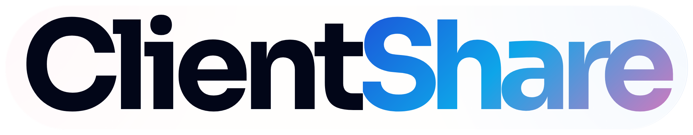

ClientShare is a secure, branded client portal for teams that need a better way to send files, collect uploads, and keep sensitive document exchange out of email threads.

ClientShare prioritizes self-hosted deployments, with sensible defaults for small firms and room to grow into more advanced hosted setups. Out of the box, it gives you a private portal for sharing files, requesting documents, managing access, and presenting a more professional client experience.

## Why ClientShare

- Keep client files in one place instead of scattered across inboxes and shared links.
- Give clients a clean upload and download experience with branded portal settings.
- Control access with users, roles, permissions, and secure links.
- Start with SQLite and local storage, then move to Postgres, MySQL, or S3-compatible storage when needed.
- Run it yourself without stitching together separate tools for auth, file exchange, and portal UX.

## Feature Highlights

- Secure client portal for sending files and collecting uploads
- Expiring secure links for controlled external access
- User and role-based access control
- Client, folder, and file organization
- Email-driven workflows for invites and password resets
- Branding controls for site title, logo, and primary color
- Local-first self-hosting defaults with optional hosted-oriented tenancy mode
- Vue frontend bundled into the Go app for a single deployable service

## Quick Start

### Prerequisites

- Docker
- Docker Compose

### 1. Setup and configure

```sh
mkdir clientshare
cd clientshare
mkdir config data storage
wget https://raw.githubusercontent.com/pixelcop/clientshare/refs/heads/main/docker/docker-compose.yml
wget https://raw.githubusercontent.com/pixelcop/clientshare/refs/heads/main/config/config.yaml.sample -O config/config.yaml
```

Update these values in `config/config.yaml`:

- `auth.jwt_secret`
- `auth.invite_token_secret`
- `secure_links.signing_key`
- `admin.bootstrap_email`
- `admin.bootstrap_password`

The sample config defaults to:

- single-tenant mode
- SQLite
- local file storage

### 2. Start ClientShare with Docker

```sh
docker compose up -d
```

Run this from the repository root so Docker uses [docker-compose.yml](./docker-compose.yml). The container mounts your local `config`, `data`, and `storage` directories, so configuration, database files, and uploads persist on the host.

Open `http://localhost:8080`.

## Building

### Source build prerequisites

- Go
- Bun
- GNU Make
- A C toolchain with SQLite development headers for local Go builds

### Build from source

Build frontend and backend components:

```sh
make build-web build
```

This produces the main server binary plus the migration and import tools:

- `clientshare`
- `goose`
- `importclients`

### Build a Docker image

```sh
make build-docker
```

This uses [docker/Dockerfile](./docker/Dockerfile) to build the frontend, generate email templates, compile the Go binaries, and package the runtime image.

## Development

### Backend

```sh
make run
```

### Frontend dev server

```sh
make run-web
```

With `dev_mode: true`, the Go app can proxy to the Vite dev server during development.

### Tests

```sh
make test
make test-web
make test-all
```

### Migrations

```sh
make migrate
make migrate-down
make migrate-create name=add_feature
```

## Configuration

Most runtime settings live in [config/config.yaml.sample](./config/config.yaml.sample).

Useful defaults and options include:

- `tenancy.mode`: `single` or `hosted`
- `database.driver`: `sqlite`, `postgres`, or `mysql`
- `storage.type`: local filesystem or S3-compatible object storage
- `branding`: site title, logo path, and primary color
- `internal_api`: disabled by default for self-hosted installs

For local development overrides, see [docs/env.md](./docs/env.md).

## Stack

- Go backend
- Fiber web server
- GORM models and Goose-style migrations
- Vue 3 frontend with Vite
- SQLite by default for the easiest self-hosted setup

## Project Layout

- [cmd](./cmd) entrypoints for the server and import tools
- [internal/handlers](./internal/handlers) HTTP handlers and route registration
- [internal/services](./internal/services) business logic and supporting services
- [internal/models](./internal/models) application models
- [internal/database/migrations](./internal/database/migrations) schema migrations
- [web](./web) Vue frontend
- [public](./public) static assets

## Deployment Notes

ClientShare defaults to a simple self-hosted setup:

- SQLite database
- local storage under `./storage`
- bundled frontend served by the Go application

For more advanced deployments, you can switch to Postgres or MySQL, use S3-compatible storage, and enable hosted-oriented tenancy features when needed.

## Status

ClientShare is an active open-source project focused on secure client document exchange and self-hosted deployments.

If you need a branded client portal for file requests, sensitive uploads, or recurring document handoff, this repo is the place to start.

## License

AGPL, Copyright (C) 2026 Pixelcop Research, Inc.
